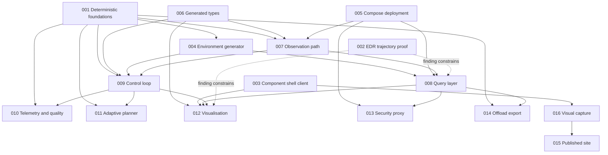

# Delivery plan: dependency graph and parallel waves

The SRD puts all eighteen components in scope and observes that this is a large
surface for spare-time work, with ordering treated as a commitment (§10). This
document turns that ranking into a dependency graph, and identifies which features
can genuinely be built at the same time.

The ordering criterion from the SRD is **cost of getting it wrong late**, not size and
not enthusiasm.

## Features

| # | Feature | SRD anchor | §10 rank |
|---|---|---|---|
| 001 | Deterministic replay foundations | C-01, FR-09..FR-11, NFR-04 | 1 |
| 002 | EDR trajectory provider (proof) | FR-20, FR-50, FR-51 | 2 |
| 003 | Component shell client | FR-01, FR-45, FR-52, C-18 | 3 |
| 004 | Environment generator | C-02, FR-02..FR-05 | 4 |
| 005 | Compose deployment | NFR-05..NFR-07 | 5 |
| 006 | Generated types | NFR-01..NFR-03 | 6 |
| 007 | Observation path | C-03..C-07, FR-12..FR-18 | — |
| 008 | Query layer | C-08, C-09, FR-19..FR-21 | — |
| 009 | Control loop | C-11..C-14, FR-22..FR-31 | — |
| 010 | Telemetry and quality | C-16, FR-37, FR-38 | — |
| 011 | Adaptive planner | C-15, FR-32..FR-36 | below the line |
| 012 | Visualisation | FR-46..FR-49, FR-52, FR-53 | — |
| 013 | Security proxy | C-10, FR-39..FR-42 | below the line |
| 014 | Offload export | C-17, FR-43, FR-44 | below the line |
| 015 | Published site | PR-06..PR-09 | below the line |
| 016 | Visual capture | PR-10, FR-53 | — |

## Dependency graph

Dotted edges are constraint rather than code: the spike's finding decides the shape of
the read path and the client's centrepiece, but nothing waits on its artefacts.

## Waves

A wave is a set of features whose implementation touches disjoint directories and
whose inputs are already satisfied. Everything within a wave can proceed at once.

### Wave 1 — foundations and unknowns

| Feature | Owns | Why it can start now |
|---|---|---|
| 001 Deterministic foundations | `libs/harness_core/`, common config schema, lint gates | Depends on nothing. Everything depends on it, and it is the one thing §10 says cannot be retrofitted. |
| 002 EDR trajectory proof | `spikes/edr-trajectory/` | Depends on nothing but a pygeoapi container. Now a narrow proof rather than an open question; feature 008 builds the provider on its finding. |
| 003 Component shell client | `client/` | Needs only the heartbeat message shape, which it defines. The feedback surface and the always-showable artefact. |
| 005 Compose deployment | `deploy/`, `config/local/`, `config/droplet/` | Needs only the list of components, which the SRD already fixes. Drift between local and droplet is cheaper to prevent than to remove. |
| 006 Generated types | `contracts/openapi/`, `libs/harness_types/`, `client/src/generated/` | The generator chain can be stood up against the schemas that exist; §10 requires it before any message has a second consumer. |

Wave 1 is five features across five disjoint trees. The only shared surface is
`contracts/schemas/`, and additions there are additive: 001 adds the common config
schema, 003 adds the heartbeat schema, 006 adds the OpenAPI documents that reference
them.

**Wave 1 exit criterion:** the greyed-out shell is live on the droplet, all components
dark, driven by real heartbeats — of which there are none yet, which is the point. The
lint gates fail the build on a planted wall-clock call.

### Wave 2 — the data spine

| Feature | Blocked on | Owns |
|---|---|---|
| 004 Environment generator | 001 (RNG, manifest) | `services/env_generator/` |
| 007 Observation path | 001, 005, 006 | `services/sensors/`, `services/ingest/`, `stores/` |
| 016 Visual capture | 003 | `client/e2e/`, `scripts/capture/` |

004 and 007 are disjoint and run together. 016 joins them because the shell exists by
then and the capture pipeline wants exercising early, not at the end.

**Wave 2 exit criterion:** synthetic observations flow from sensors through the single
ingestion seam into the store, the generator's ground truth is on disk beside the
field, and the sensor and ingest components are lit in the client.

### Wave 3 — read path and cycle

| Feature | Blocked on | Owns |
|---|---|---|
| 008 Query layer | 004, 005, 007, and the 002 finding | `query/`, `stores/coverage/` |
| 009 Control loop | 001, 004, 006, 007 | `services/monitor/`, `scheduler/`, `model_runner/`, `publisher/` |

These two are the largest pieces and they are genuinely independent in code: the
control loop subscribes to the broker and writes the coverage store, and the query
layer reads it. They share only the coverage store layout convention, which 008 owns
and 009 consumes. Sequence them if the coverage layout proves contentious; otherwise
run them together.

**Wave 3 exit criterion:** AT-01 and AT-02. A trajectory query returns correct values
along a four-dimensional route verified against the manifest, and a threshold breach
triggers a model run visibly, end to end, in the client.

### Wave 4 — what the cycle makes possible

| Feature | Blocked on | Owns |
|---|---|---|
| 010 Telemetry and quality | 009 | `services/telemetry/` |
| 011 Adaptive planner | 009 | `services/planner/` |
| 012 Visualisation | 003, 008, 009 | `client/src/` additions |
| 013 Security proxy | 005, 008 | `proxy/`, `tests/leakage/` |
| 014 Offload export | 008 | `services/offload/` |

Five features, five disjoint trees, all unblocked at the same moment. This is the
widest wave and the one where parallel work pays most.

**Wave 4 exit criterion:** AT-03 and AT-04. The seeded eddy is recoverable with a known
and reported error, and the whole scenario replays deterministically from its seed.

### Blog and site, pulled forward

PR-08 puts one blog entry per feature after the feature works, and §10 puts the blog
machinery below the line. The *machinery* has nonetheless been pulled into wave 1, on
the author's instruction, for one reason: a publishing pipeline that has never
published is not known to work, and finding that out after fifteen features is worse
than finding it out now. The MkDocs site, the `gh-pages` workflow and one inaugural
post ship in wave 1; the per-feature posts still follow their features.

### Wave 5 — the record

| Feature | Blocked on | Owns |
|---|---|---|
| 015 Published site | 016, and one working feature to write about | `docs/`, `site/` |

PR-08 requires one blog entry per feature, written after the feature works. The
machinery can be built in wave 1 if it is convenient, but the SRD puts it below the
line deliberately: it does not punish lateness.

## What is deliberately not parallelised

- **001 before anything that keeps time or draws a random number.** Not a scheduling
  preference; a correctness constraint. A component written against the host clock is
  not cheaply repaired later.
- **The 002 finding before 008 commits to a read-path shape.** Narrower than it was —
  the question is now only whether the M ordinate survives WKT parsing — but 008's
  bespoke provider is built against that answer, so it still goes first.
- **009's four services among themselves.** Monitor, scheduler, model runner and
  publisher form one cycle with one set of invariants. Splitting them across
  simultaneous workers invites four different readings of what "current" means.

## Risks to the schedule

| Risk | Mitigation |
|---|---|
| The M ordinate does not survive WKT parsing at the pinned versions | FR-51 pins Shapely >= 2.1 / GEOS >= 3.12 with the reason inline and a test asserting M survives; below those versions the failure is silent, which is the actual risk |
| The Shapely / GEOS pin is removed as housekeeping by someone who cannot see why it is there | The pin carries its reason at the pin, ADR-0003 records it, and the test fails loudly if it is lost |
| The coverage store layout is contested between 008 and 009 | 008 owns it, records it in `stores/coverage/`, and an ADR captures the argument |
| Parallel workers drift on message shapes | 006 exists precisely to prevent this, and the drift check is a CI gate |
| The client outgrows one worker | 003 builds the shell and the liveness substrate; 012 adds panels on top and touches no file 003 owns |
