# Delivery plan: dependency graph and parallel waves

Updated and consolidated 28 August 2026. The SRD puts the harness's purposes in strict
priority order — understanding, demonstration, evidence (§1) — and treats ordering as a
commitment, ranked by **cost of getting it wrong late** (§10). This document turns that
into a dependency graph, a record of what is delivered, and the waves that remain. It
was first written before feature 001 existed; the pre-delivery wave tables it carried
then are in this file's history, and their exit criteria are summarised below as
outcomes rather than plans.

## Features

| # | Feature | SRD anchor | Status |
|---|---|---|---|
| 001 | Deterministic replay foundations | C-01, FR-09..FR-11, NFR-04 | Delivered. T033/T042/T047 open: AT-04 scores the weaker replay claim |
| 002 | EDR trajectory provider (proof) | FR-20, FR-50, FR-51 | Delivered; finding recorded in `spikes/edr-trajectory/FINDING.md` |
| 003 | Component shell client | FR-01, FR-45, FR-52, C-18 | Delivered. T040 first-paint measurement never taken |
| 004 | Environment generator | C-02, FR-02..FR-05 | Delivered. T044 size/time measurement never taken |
| 005 | Compose deployment | NFR-05..NFR-07 | Delivered. T028 reset-then-reseed proof still a human ritual |
| 006 | Generated types | NFR-01..NFR-03 | Delivered. T029–T031, T039, T040 done 28 Aug (lane C); only T025, a second operating system, is open |
| 007 | Observation path | C-03..C-07, FR-12..FR-18 | Delivered, live |
| 008 | Query layer | C-08, C-09, FR-19..FR-21 | Delivered. T062 waits on a live published run; the SensorThings 404 is fixed (lane C) |
| 009 | Control loop | C-11..C-14, FR-22..FR-31 | Passes in-process; **not wired live** — T052–T058 outstanding |
| 010 | Telemetry and quality | C-16, FR-37, FR-38 | Delivered |
| 011 | Adaptive planner | C-15, FR-32..FR-36 | Delivered |
| 012 | Visualisation | FR-46..FR-49, FR-52, FR-53 | Delivered except the map-mounted layers (T032, T038 → 017) |
| 013 | Security proxy | C-10, FR-39..FR-42 | Delivered |
| 014 | Offload export | C-17, FR-43, FR-44 | Delivered. T040/T045/T046 carry no note — status unknown |
| 015 | Published site | PR-06..PR-09 | Delivered; 19 partial marks want re-reconciliation against the built site |
| 016 | Visual capture | PR-10, FR-53 | Delivered |
| 017 | Map surface | FR-47, FR-48 lineage; closes 012 T032/T038 | Specified; no plan or tasks |
| 018 | Read-path boundaries | §2.2's boundary story, PR-09 | Specified; no plan or tasks |
| 019 | Coverage holdings | §5.10, FR-54 to FR-58 | Specified; gated on wave 6's exit criterion |
| 020 | Shore advisories | §5.11, FR-59 to FR-66 | Specified; gated on wave 6's exit criterion |

Progress at consolidation: 745 recorded tasks, 685 ticked, all four acceptance tests
passing, 14 gates clean.

## Where the goals and the work stand

**Understanding** (the SRD's first purpose) is the strongest leg: seven spikes with
findings, nineteen ADRs, session logs that record what decisions cost. **Evidence**
(third) is mostly sound, and its hazard is records that fall behind the tree.
**Demonstration (second) is the weakest leg**, and the constitution's bar for it is
"runnable from a clean checkout with one command, and visible in the client":

- The four acceptance tests pass **in one process, with the broker stood in by a
  recorder** — which is what they claim, and no more.
- In the composed stack, six of the seven loop-side services — scheduler, model
  runner, publisher, telemetry, offload, planner — run their loop over an empty
  message iterable and exit 0. Only the monitor opens a broker subscription (009
  T058). No divergence becomes a run; no run is ever published live; 008 T062
  correctly answers "no run is current".
- ~~The SensorThings entity sets 404 against the running query layer.~~ Fixed 28 August
  by lane C: the routing was sound and the advertised links were a collection short of it
  (long-run-01 BLOCKED, 2026-08-28T12:55).
- deck.gl is a declared dependency nothing under `client/src` imports; the
  uncertainty and route displays are built and tested with no surface to draw on.

Features 019 and 020 extend scope beyond the SRD by their own statement, on top of
that gap. The refocus is not to abandon them; it is to put the loop's first live turn
ahead of them, which is what §10's own ordering criterion already says.

## Decisions taken, 28 August 2026

Four questions this plan surfaced were put to the owner and answered. Recording them
here is what stops a lane re-litigating them; the ADRs land with the lanes named.

| Decision | Consequence | Lands in |
|---|---|---|
| **Database authentication needs no secrets.** The observation store binds to 127.0.0.1 at every destination; the harness models no database threat. Postgres moves to trust authentication for the compose network; DSNs name a role and carry no password; `_with_database_secret` is retired rather than extended. | **Dissolves 009 T059**: there is no credential-ordering constraint. What remains is the unseeded-schema case — a service starting before seeding treats missing tables as a transient, retries with backoff, and reports truthfully. Also resolves the three passwordless roles flagged in DECISIONS 2026-08-28T08:50. | Lane D, with an ADR (the broker's credential path, ADR-0016, is unchanged) |
| **The control namespace is public-read by design.** The `/ctl` `auth_basic` exemption and the world-readable viewer credential are the intended boundary: binary clearance for `/released`, delegation to the broker's ACL for the control upgrade. | ADR-0001's amendment moves from *proposed* to *accepted*; the viewer credential is documented as a non-secret (subscribe-only on `ctl/`, public by design). No code changes. | Lane E |
| **The SRD is amended to name both 019 and 020.** The holdings and the advisory product become SRD requirements with the argument recorded, per both specs' own delivery condition. | 019/020 planning can pass a Constitution Check once the amendment merges. Landed as SRD v0.4: §5.10 (FR-54 to FR-58), §5.11 (FR-59 to FR-66), two component rows, and two §11 rows. | Lane G, as a PR for the owner's review |
| **019 and 020 start only after the loop turns live** and the SRD amendment has merged. | Wave 8 is gated on wave 6's exit criterion plus one merge, not on a calendar. | Wave 8 preconditions |

## Dependency graph

```mermaid
graph TD
  subgraph delivered
    F001[001 Deterministic foundations]
    F002[002 EDR trajectory proof]
    F003[003 Component shell client]
    F004[004 Environment generator]
    F005[005 Compose deployment]
    F006[006 Generated types]
    F007[007 Observation path]
    F008[008 Query layer]
    F010[010 Telemetry and quality]
    F011[011 Adaptive planner]
    F012[012 Visualisation]
    F013[013 Security proxy]
    F014[014 Offload export]
    F015[015 Published site]
    F016[016 Visual capture]
  end
  F009[009 Control loop, live wiring]
  F017[017 Map surface]
  F018[018 Read-path boundaries]
  F019[019 Coverage holdings]
  F020[020 Shore advisories]
  SRD[SRD amendment for 019 and 020]

  F001 --> F009
  F006 --> F009
  F007 --> F009
  F003 --> F017
  F012 --> F017
  F006 --> F018
  F012 --> F018
  F008 --> F019
  F009 --> F019
  F007 --> F020
  F008 --> F020
  SRD --> F019
  SRD --> F020
  F017 -.client stories follow.-> F018
  F017 -.story 4 only.-> F020
```

Dotted edges order work without blocking a feature's core: 018's server-side artefact
and gate depend only on 006, and 020's stories 1–3 need nothing from 017.

## Delivered: waves 1–5, in summary

The original five waves ran 001–016 to delivery. Their exit criteria hold with two
caveats that shape everything below: wave 3's criterion (AT-01, AT-02) holds
**in-process**, with the transport stood in, because the loop services were never
wired to the broker in the composed stack; and wave 4's (AT-03, AT-04) holds with
AT-04 scoring generator reproducibility — the weaker claim — because 001 T042's
two-participant replay scenario was never built. The stale-record episode `CLAUDE.md`
documents (196 done / 33 partly / 23 outstanding against 248 unticked) happened across
these waves; the claims found stale on this consolidation are tabled below so nobody
re-litigates them.

| Record | It says | The tree says |
|---|---|---|
| 009 T051 note | the monitor reads no published field and AT-02 fails at its first assertion | landed in `009b20d`; all four acceptance tests pass |
| 006 T029–T031 note | blocked because "feature 008 does not exist" | 008 is built, 61 of 62 ticked; the three tasks are actionable now |
| 015 T029 note | eighteen subsystem pages open with "Status: not yet built" | sixteen say "built", two "partly built" |
| 015 reconciliation outcome block | "there is no `site/gates/` directory", "US2 does not exist" | contradicted by the per-task notes above it; trust those |
| 014 T040, T045, T046 | nothing — no note at all | unknown; the only unticked tasks in the repository with no reason recorded |

**Closed by lane E, 28 August 2026.** Rows three and four of that table are settled against
the tree, and the two documentation carry-overs beside them with them.
`specs/015-published-site/tasks.md` now carries a dated correction appended beneath the
27 August outcome block — never a rewrite of it — recording that sixteen subsystem pages say
"built" and two "partly built", that `site/gates/` and `docs/manifest.yaml` both exist, and
that the records are published. Fourteen of the nineteen partial marks were re-checked and
ticked; five remain partial and each now names what specifically is missing. 007 T045 is
written as `docs/architecture/observation-path.md`. 008 T058's tick was right and its note
stale; 008 T006's tick was wrong and its note right, so it is unticked and cross-referenced to
009 T055, which carries the same master. ADR-0020 is accepted and the viewer credential is
documented as a non-secret. PR-08's gap is closed: seven entries were written for 006, 007,
008, 011, 012, 013 and 014, so every delivered feature has one.

## The genuinely outstanding work, consolidated

| Cluster | Items | Why it matters |
|---|---|---|
| The loop, live | 009 T052–T055, T058 (keystone); then 008 T062 follows | AT-02's SRD wording — "visibly, end to end, within the client" — becomes true of the running stack |
| ~~The read path's bug~~ | ~~SensorThings 404~~ — done, lane C, 28 August | FR-19 is served: 23 links walked from the service root over HTTP, all 200 |
| The map | 017 (spec exists; plan and tasks do not) | closes 012's recorded partials; first thing a visitor looks at |
| Deploy simplification | trust auth per the decision above; 005 T028 | retires the DSN-secret machinery; proves the reset-reseed claim |
| Offload unknowns | 014 T040, T045, T046 unnoted; T047-geometry half-closed | three tasks of unknown status is how the last reconciliation debt started |
| ~~Generated types carry-over~~ | ~~006 T029–T031, T039, T040~~ — done, lane C, 28 August | the query layer's contract is vendored and generated from; ADR-0022 records the generator selection |
| The topology contract | 018 story 2 (scanner, artefact, drift gate) | this repository's own medicine applied to its own topology; blocks nothing and is blocked by nothing |
| The scope amendment | SRD growth for 019/020 | drafted as SRD v0.4; with the owner for review |
| Unevidenced success criteria | 003 T040, 004 T044 | measured claims the record asserts and nothing measures |
| Replay's weaker claim | 001 T033, T042, T047 | do T042 or amend the claim, not neither |
| Documentation carry-overs | 007 T045, 008 T006/T058 truth, 015 re-reconciliation, ADR-0001 acceptance | evidence hygiene; smaller than the record claims |

## Wave 6 — the loop turns where a person can watch it

Seven lanes, disjoint trees, all startable now — each is one agent session on its own
branch with its own pull request. The shared surfaces are the usual append-only files,
under the usual rules.

| Lane | Branch | Owns | Work |
|---|---|---|---|
| A — control loop | `claude/loop-live-wiring` | `services/{scheduler,model_runner,publisher,telemetry,offload,planner}/` | 009 T052–T055, T058; unseeded-schema tolerance per the auth decision. 008 T062 then flips on its own |
| B — map | `claude/017-map-surface` | `client/src/` (map-owned area) | 017: plan and tasks via spec-kit, then stories P1–P3. Shares only the shell integration point, append-only |
| C — query | `claude/query-read-path` | `query/`, `contracts/openapi/` | the SensorThings 404, then 006 T029–T031, T039, T040 |
| D — deploy | `claude/offload-and-deploy-debts` | `deploy/`, `stores/` (auth only), `services/offload/` | trust auth + its ADR; 014 T040/T045/T046 status established then done or noted; 005 T028 |
| E — record | `claude/evidence-reconciliation` | `site/`, `docs/`, the named `tasks.md` files | ADR-0001 amendment accepted and the viewer credential documented as public; 015 re-reconciled; 007 T045; 008 T006/T058 truth; missing blog entries |
| F — topology gate | `claude/018-topology-gate` | `contracts/` and `scripts/` (appends), `docs/architecture/repo-layout.md` | 018 story 2 only: master, scanner, generated artefact, drift gate watched failing |
| G — scope | `claude/srd-holdings-advisories` | `harness-srd.md`, the two specs' Assumptions | the SRD amendment for 019/020, as a PR for the owner's review |

**Wave 6 exit criterion:** from a clean checkout, `./scripts/run_local.sh`, and a
browser: a threshold breach becomes a divergence, a run request, a published run, and a
field refresh drawn on the map — AT-02 as the SRD wrote it, live, with every component
lit by its own heartbeat. Lanes A and D both change bring-up behaviour without sharing
code; whichever merges second re-runs `run_local.sh` twice on the merged result before
its pull request closes.

## Wave 7 — the read-side client, and the residue

| Item | Blocked on | Notes |
|---|---|---|
| 018 stories 1, 3, 4 | 017 landing the shell integration; lane F's artefact | the read-path view, the matrix lit by real traffic, the badges |
| 001 T042/T047 replay scenario | nothing | upgrades AT-04 from the weaker claim to the stated one |
| 003 T040, 004 T044 measurements | a destination | the droplet halves need the droplet |

## Wave 8 — the data landscape grows

Preconditions, per the decisions above: the wave 6 exit criterion holds, and SRD v0.4
has merged. 019's accumulation story then builds on runs that genuinely publish, rather
than retention of runs that never happen.

Two of the amendment's own consequences land with these features rather than with lane
G. 020 inherits two component identifiers — C-19, the shore advisory source, and C-20,
the advisory store — which `docs/manifest.yaml` records as not yet built and which want
a subsystem page each when they exist. FR-12 now names three schemas in the one Postgres
instance rather than two, and the constitution's technology line was amended with it
(1.5.0, ADR-0024); what that record leaves to 020's plan is the test that asserts the
negative — `features` still refused to every run-time role, beside an `advisories` that
is deliberately writable — because what separates them is a grant.

| Feature | Branch | Owns | Parallel with |
|---|---|---|---|
| 019 coverage holdings | `claude/019-coverage-holdings` | services-side authoring, `stores/coverage/` convention, query configuration | 020 stories 1–3 (shared files are append-only) |
| 020 shore advisories, stories 1–3 | `claude/020-shore-advisories` | advisory schema, topic, store, authoring, collection | 019 |
| 020 story 4 | — | the map | after 017; deliberately separable |

## What is deliberately not parallelised

- **009's remaining wiring stays one lane.** Monitor, scheduler, model runner and
  publisher form one cycle with one set of invariants; splitting them invites four
  readings of what "current" means.
- **019 and 020 wait on the two stated gates, not on enthusiasm.** Starting them
  before the SRD amendment is how a spec stops describing the system.
- **The client shell's integration point is append-only for 017 and 018 alike**, and
  018's client stories follow 017 rather than racing it.

## Risks to this schedule

| Risk | Mitigation |
|---|---|
| The record rots again while seven lanes run | each lane ticks as it goes and re-reconciles its own file; a wave does not close on green CI alone but on the record matching the tree |
| Lanes A and D interleave on bring-up behaviour | no shared code, but the second to merge re-runs the converge-twice check on the merged result before closing |
| 017 grows a data dependency on the loop lane | it must not: the map draws fetched data and states absence; an empty stack renders the extent and the statement, which is demonstrable on its own |
| The SRD amendment stalls in review | it gates only wave 8; wave 6 and 7 lanes proceed regardless, and the gate is a merge, not a date |
