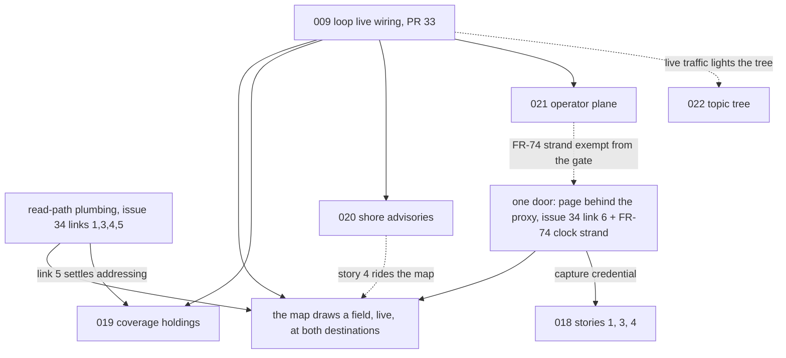

# Delivery plan: dependency graph and parallel waves

Consolidated 28 August 2026 and re-sequenced that evening, after six of wave 6's seven
lanes merged and the tree grew SRD v0.5, feature 021 and issue #34. The SRD puts the
harness's purposes in strict priority order — understanding, demonstration, evidence
(§1) — and treats ordering as a commitment, ranked by **cost of getting it wrong late**
(§10). This document turns that into a dependency graph, a record of what is delivered,
and the two waves that remain. Earlier wave tables are in this file's history; their
exit criteria are summarised below as outcomes rather than plans.

## Features

| # | Feature | SRD anchor | Status |
|---|---|---|---|
| 001 | Deterministic replay foundations | C-01, FR-09..FR-11, NFR-04 | Delivered. T033/T042/T047 open: AT-04 scores the weaker replay claim |
| 002 | EDR trajectory provider (proof) | FR-20, FR-50, FR-51 | Delivered; finding recorded in `spikes/edr-trajectory/FINDING.md` |
| 003 | Component shell client | FR-01, FR-45, FR-52, C-18 | Delivered. T040 first-paint measurement never taken |
| 004 | Environment generator | C-02, FR-02..FR-05 | Delivered. T044 size/time measurement never taken |
| 005 | Compose deployment | NFR-05..NFR-07 | Delivered. T028 proven by test (lane D); partials T025/T027/T030/T045 remain |
| 006 | Generated types | NFR-01..NFR-03 | Delivered. Only T025, a second operating system, is open |
| 007 | Observation path | C-03..C-07, FR-12..FR-18 | Delivered, live |
| 008 | Query layer | C-08, C-09, FR-19..FR-21 | Delivered. T062 ticks with lane H's watched live publication |
| 009 | Control loop | C-11..C-14, FR-22..FR-31 | **Delivered and wired live** (PR #33 merged, 28 August): every task ticked, all six loop services subscribe and follow the clock, and the generator/control profiles are active at local |
| 010 | Telemetry and quality | C-16, FR-37, FR-38 | Delivered |
| 011 | Adaptive planner | C-15, FR-32..FR-36 | Delivered |
| 012 | Visualisation | FR-46..FR-49, FR-52, FR-53 | Delivered; T032 and T038 closed by 017 |
| 013 | Security proxy | C-10, FR-39..FR-42 | Delivered |
| 014 | Offload export | C-17, FR-43, FR-44 | Delivered. Only T047-geometry's producer half open (lane D closed T040/T045/T046) |
| 015 | Published site | PR-06..PR-09 | Delivered; re-reconciled by lane E, five partials each naming what is missing |
| 016 | Visual capture | PR-10, FR-53 | Delivered. Wave 7 adds a credential to its contract (issue #34, link 6) |
| 017 | Map surface | FR-47, FR-48; closed 012 T032/T038 | Delivered (P1–P3) — **and has never drawn a field**: five broken links, none in the client (`spikes/map-to-ocean/FINDING.md`, issue #34) |
| 018 | Read-path boundaries | §2.2's boundary story, PR-09 | Story 2 delivered (topology artefact and drift gate, lane F); stories 1, 3, 4 are client work, wave 7 |
| 019 | Coverage holdings | §5.10, FR-54..FR-58 | Specified; gated on the loop's live turn (SRD §10) |
| 020 | Shore advisories | §5.11, FR-59..FR-66 | Specified; same gate. Constitution 1.5.0 already carries the third-schema amendment; C-19/C-20 typed "not yet built" in `docs/manifest.yaml` |
| 021 | Operator plane | §5.12, FR-67..FR-76 | Specified (SRD v0.5, `spikes/operator-plane/FINDING.md`); same gate, **except FR-74's clock-through-boundary strand**, which repairs FR-10 and is exempt. C-21 typed "not yet built" |
| 022 | Topic tree | the broker-as-trigger-surface argument; rides 018's topology artefact | Specified (PR #38, 28 August); no plan or tasks. Client panel plus one new read-only role declaration; consumers named, not built |
| 023 | EDR query composer | §5.13, FR-77..FR-83 | Specified (PR #39, 28 August); no plan or tasks. §10 splits it: the query-layer half (FR-78's radius, area, corridor and locations) waits on nothing; the client half begins once 021 stands and 017's map has a selection model |

## Where the goals and the work stand

**Understanding** remains the strongest leg, and wave 6 fed it further — the
map-to-ocean investigation alone is the kind of finding the harness exists to produce.
**Evidence** is in good order after lane E's re-reconciliation. **Demonstration** is
still the weakest leg, and it is now weak in a more precise way:

- **The loop is wired and merged** (PR #33, 28 August): all six loop services
  subscribe and follow the clock, 009's task list is fully ticked, and the generator
  and control profiles are active at local. What remains of the SRD's gate criterion
  is the *observation*: nobody has yet watched a threshold breach become a published
  run in the client, from one command. That observation is lane H's first act, and it
  is what opens wave 8.
- The map is built, honest, and empty: **five separate links between the coverage store
  and the browser are broken, and none of the five is in the client**
  (`spikes/map-to-ocean/FINDING.md`; the work list, in dependency order, is issue #34).
  Two of the five are lane A's; three have no owner, one of those three lost its owner
  when a half-fixed fault was struck from this plan's table as done.
- The droplet has never served the client at all: its proxy publishes neither the page
  nor the clock, so the address `public_url` advertises has answered 401 to everything,
  always. Local publishes the page beside the boundary instead of behind it. Both
  destinations were configured for a shape nobody built.

## Decisions on record

The four decisions of 28 August (morning) stand as recorded in this file's history and
in the ADRs: trust auth inside the compose network (dissolving 009 T059); the control
namespace public-read (ADR-0020 accepted); the SRD amended for 019/020 (landed as
v0.4); and 019/020 gated on the loop's live turn — a gate SRD v0.5 now states itself,
extending it to 021.

Taken that evening, recorded on issue #34 and in `spikes/map-to-ocean/FINDING.md`:

| Decision | Consequence |
|---|---|
| **The page is served through the proxy**, behind the same clearance as everything else | one credential covers page, data and control socket; `auth_basic` stays declared once at server level; drogna becomes a private demonstration whose address is handed out |
| **The clock is not proxied now**; the droplet's client document is corrected instead | a destination publishing no clock route renders the speed control unavailable and says why (012 built that state). FR-74's exempt strand later ends the direct exposure properly — the near-term correction and the eventual routing are stages, not rivals |
| **The local direct publish of the client is dropped** | the client binds 127.0.0.1 at both destinations; `public_url` and the capture configuration point at the proxy; one shape, one door. Consequence: every capture mechanism needs the credential — a field in `config.capture.schema.json` and Playwright `httpCredentials` across 016's three mechanisms |

Taken later that evening, by structured interview, closing the two items wave 7 could
pull forward:

| Decision | Consequence |
|---|---|
| **Link 5 is decided: the announcement carries the fixed collection identifier and the run separately** — the finding's first reading. A consumer addresses the fixed collection for the current run and a named EDR instance for a specific one | lane H's client half is unblocked the moment PR #33 merges, and 019's instance addressing has its scheme. Recorded on issue #34 |
| **`collections.uncertainty` is removed from the run-published master**, not deprecated — it names a collection that will never exist | the schema master is amended, both language forms regenerate through the chain, the publisher and the two client fetch sites follow. Lane H's work, since it owns the announcement |
| **The third wall-clock exemption is granted by amendment**: constitution 1.6.0, resource sampling confined to C-21's sampler module, readings as their own host-time telemetry kind (ADR-0026) | 021's first gate is satisfied before the wave that builds it; the erosion clause now counts four |
| **The runtime socket stops at the door**: mounted into C-21 alone, and lifecycle may target any component except the proxy, the controller itself, and the broker (ADR-0026) | the trust surface is bounded before it exists; a command naming an excluded component is refused with the exclusion named |
| **The operator plane sits behind the clearance** — the /ctl delegation does not transfer to REST once the page shares the proxy's origin; FR-74 is corrected in step (SRD v0.6, ADR-0025) | 021's second gate is satisfied; the droplet never exposes an unauthenticated command surface, and the plane needs no authentication of its own |

A third round, taken the same evening, cleared the remaining open questions the specs and
session records still carried:

| Decision | Consequence |
|---|---|
| **The generator and control profiles join `profiles.active` at both destinations** | the loop has processes to turn in wherever the harness is deployed — without this, PR #33's wiring merges into a destination that runs none of it. Lane H implements alongside its seed step; PR #33 may pass the profiles explicitly for its own live verification in the meantime |
| **014 T047's geometry travels beside the bundle, never inside it** — a `run-manifest.json` staged and transferred as its own object | SC-006 stays true as written, 013's provenance rules gain no exception, and the leakage consumer already reads exactly that shape. Recorded in 014's `tasks.md` beside the proposal it settles; implementation joins lane K's residue |
| **ADR-0021 is accepted, with its successor named** — it records the running system's shape until lane I routes the clock, when ADR-0025 supersedes it | the last Proposed record is settled, and the supersession marking waits for the tree to change rather than preceding it |
| **The droplet's real hostname is injected at deploy time**, like the secrets: the tracked configuration keeps the `drogna.invalid` placeholder | PR-01's "public but unadvertised" holds — the repository never carries the demonstration's address. Lane I threads it through the same render seam as the capture credential |

## Dependency graph

022 rides 018's topology artefact (delivered, lane F) and appends one read-only role
to the sources the scanner reads; nothing else waits on it and it waits on nothing.

The SRD's own gate (§10): 019, 020 and 021 begin only when the loop's turn is
demonstrable in the running system — a threshold breach becoming a published run,
watched from the client. That is satisfiable by the loop view the moment PR #33 merges
and is watched; **the map drawing a field additionally needs the plumbing and the
door**, which is why wave 7 exists.

## Delivered: waves 1–6, in summary

Waves 1–5 ran features 001–016 to delivery; their caveats (AT-02 in-process, AT-04 on
the weaker claim) are recorded in this file's history. Wave 6 ran seven lanes; six
merged on 28 August — lane B (017, PR #31), lane C (SensorThings and the query
contract's types, PR #30), lane D (trust auth, the offload debts, the reset proof,
PR #35), lane E (the record re-reconciled, ADR-0020, the blog gap, PRs #27/#29),
lane F (the topology artefact and gate, PR #28), lane G (SRD v0.4, PR #26) — and
lane A merged as PR #33 later the same day, closing the wave's code in full. The stale-records table this plan carried is settled and
lives in history; one new instance replaced it: lane C's fix closed the SensorThings
item while the proxy's upstream half of the same fault stood unfixed, and the struck
row read as done. The half is measured in `spikes/map-to-ocean/FINDING.md` and owned
again below. The lesson is the standing one — the tree is the authority — with a
sharper edge: **a row struck through is a claim too.**

## Closing wave 6: one observation left

PR #33 merged with its collisions fixed and the converge re-run done, so steps one to
three of the close-out this section used to list are history. What remains is step
four, and it is deliberately not waved away: **watch the SRD's gate criterion actually
happen** — a threshold breach becoming a published run, in the client's loop view,
from one command — and record the observation with a capture. The merge proved the
code; the observation is the demonstration, and it is what opens wave 8's gate. It is
lane H's first act below, because lane H is first at the running stack.

## Wave 7 — the ocean reaches the browser, everywhere

Five lanes, all startable now. Disjoint trees; the one boundary file both plumbing
lanes could touch, `config/*/proxy.json`, is owned by lane I alone, and the client
shell's integration point — which lanes J and L both append to — stays append-only as
it did for 017 and 018.

| Lane | Owns | Work |
|---|---|---|
| H — plumbing | `deploy/seed.d/`, `services/publisher/` (catalogue announcement), `client/src/map/fieldRequest.ts`, `client/src/route/trajectoryQuery.ts` | **First act: the watched turn** — bring the stack up, watch a breach become a published run in the client's loop view, capture it, and record the observation (this opens wave 8's gate and ticks 008 T062). Then issue #34 links 1 and 5: a `030-coverage.sh` seed step authoring one run through the publisher's own code path (seed data in the constitution's sense, not a Constitution VII fixture — the client fetches it over the real boundary); then, per the decided link 5 (fixed collection id and run carried separately, `collections.uncertainty` removed from the master), the announcement and the two client fetch sites. The profiles decision is half-landed: PR #33 activated local; the droplet's line is lane I's, beside its other droplet work |
| I — one door | `proxy/`, `config/local/`, `config/droplet/`, `deploy/images/` (client), `contracts/schemas/config.capture.schema.json`, `scripts/capture/` | Issue #34 links 3, 4 and 6, plus FR-74's exempt clock strand: the upstream path and released names corrected to what the query layer serves; the page served through the proxy at both destinations; local direct publish dropped; `public_url` made true for the first time, with the real hostname injected at deploy per the decision on record; the droplet's `profiles.active` brought level with local's; the capture credential threaded through 016's three mechanisms, each watched failing without it and passing with it |
| J — read-side client | `client/src/` (read-path areas) | 018 stories 1, 3, 4: the read-path view with witnessed and inferred edges, the topology matrix lit by real traffic (the artefact and gate exist), the standards badges. Story 1's crossings become far more instructive once lanes H and I give the client reads that succeed |
| K — residue | `libs/harness_core/`, `tests/`, `services/offload/` (T047 only) | 001 T042/T047: the two-participant byte-identical replay scenario, upgrading AT-04 from the weaker claim. 014 T047 per the decided shape (geometry beside the bundle; the note in 014's `tasks.md` carries the settled proposal). 003 T040 and 004 T044's droplet halves join once lane I makes the droplet real |
| L — topic tree | `client/src/` (topic-tree panel), the role declaration in the topology's tracked sources, `specs/022-topic-tree/` | 022: plan and tasks via spec-kit, then stories in priority order. The tree is the declared topology (018's artefact, regenerated after the role declaration lands — the drift gate makes that safe) lit only by genuinely received traffic; consumers are named, never built; every stated figure simulation time. Shares only the shell integration point (append-only) and the topology-source appends |

**Wave 7 exit criterion:** at both destinations, one address, one clearance: the page
loads through the proxy, the map draws the seeded run's field, and — with PR #33
merged — refreshes on a live publication. The droplet serves the client at
`public_url` for the first time. Captures run green behind the clearance. Issue #34
closes with every link ticked against a measurement, the way it was opened.

## Wave 8 — the data landscape and the operator's hand

Preconditions, per SRD §10: the loop's turn has been *watched* in the running system.
With PR #33 merged and local's profiles active, that gate is one observation away —
lane H's first act. The moment it is recorded, all three features below may launch.

| Feature | Owns | Ordering |
|---|---|---|
| 019 coverage holdings | services-side authoring, `stores/coverage/` convention, query configuration | starts at the gate; link 5 is decided (fixed id + instance addressing), which is its home ground |
| 020 shore advisories, stories 1–4 | advisory schema, topic, store, authoring, collection; then the map layer | starts at the gate, parallel with 019 (shared files append-only). Story 4 no longer waits on anything but its own stories 1–3. FR-12's third schema and the constitution amendment (1.5.0) are already in place; the plan-phase ADR and the grant-asserting test remain 020's |
| 021 operator plane | `services/` (C-21, and FR-68's telemetry kind in every long-running component), `services/clock/` (FR-71), `client/src/` (FR-76), `proxy/` (FR-74's remainder) | **its two owed ADRs are written and accepted** (ADR-0025 exposure, ADR-0026 sampling + socket, constitution 1.6.0), so the build waits only on the wave's own gate. The C-21 controller, FR-71 clock work and FR-76 client surfaces can run parallel with 019/020, since they share no tree with either; **FR-68's every-service throughput pass lands last, after 019 and 020 merge**, because it touches every service tree and the append-only rule covers files, not modules |

C-19, C-20 and C-21 are typed "not yet built" in `docs/manifest.yaml`; each feature
writes its subsystem pages when its components exist, which is what flips those rows.

**023 straddles the waves, by the SRD's own split (§10).** Its query-layer half —
FR-78's four new query types in the bespoke provider, each with a declared budget and
a named refusal — waits on nothing and can run as a wave 7 lane in `query/plugins/`
the moment someone picks it up; it shares no tree with lanes H–L (lane H touches the
publisher and seed steps, lane I the proxy configuration, neither the provider). Its
client half — the composer mode on the map — is last in wave 8: it begins once the
operator plane is standing and 017's map has a selection model to build on, and its
two owed ADRs (the fetch-discipline exception and the SensorThings widening, per
§11) are argued at its plan phase.

## What is deliberately not parallelised

- **Wave 8 waits on the watched turn, not on wave 7.** The gate is one observation,
  recorded with a capture — never inferred from green tests, which is how AT-02 spent
  a day "passing" while the composed stack could not cycle.
- **Lanes J and L both add client panels and neither owns the shell.** The
  integration point is append-only for both, exactly as it was for 017 and 018.
- **`config/*/proxy.json` has one owner, lane I.** Links 3, 4 and 6 all land there;
  splitting them across lanes is how the last half-fix happened.
- **Link 5 was a decision before it was code, and it is decided** — the fixed-id
  reading, recorded above and on issue #34; lane H and 019 implement it, never
  re-open it.
- **021's FR-68 pass waits for 019 and 020 to merge.** Its ADR gate is satisfied
  (ADR-0025, ADR-0026); what remains gated is the build itself, on the loop's
  watched turn.

## Risks to this schedule

| Risk | Mitigation |
|---|---|
| The watched turn surfaces a live-only fault the tests missed | that is what the observation is for; lane H owns the diagnosis as part of its first act, and the wave 8 gate stays shut until the turn is genuinely seen |
| The struck-row hazard recurs — a lane closes an item whose fault has another half | issue #34 is the tracker and each link closes against a measurement, not a reading; the finding stays unedited as evidence |
| The capture credential breaks 016's three mechanisms differently | lane I watches each mechanism fail without the credential and pass with it, separately — they deliberately do not share plumbing |
| The droplet's first genuine bring-up finds new traps | it will; every prior first bring-up did. Lane I budgets for it and writes what it finds into `CLAUDE.md`'s traps or a finding, not just the fix |
| 021's socket ADR is rejected on its merits | FR-72's lifecycle commands degrade to trigger and clock commands only; the plane's display half (FR-67, FR-68, FR-76) is untouched — the spike showed it rides existing mechanisms |
| Three features churn `services/` in one wave | 019/020/021 own disjoint service trees until FR-68's pass, which is why that pass is sequenced last |
