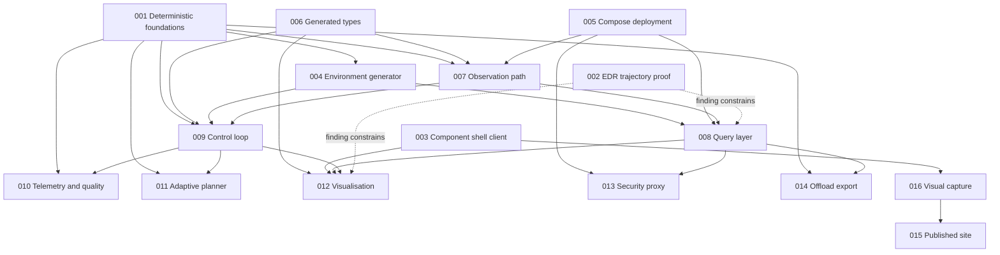

# Delivery plan: dependency graph and parallel waves

The SRD puts all eighteen components in scope and observes that this is a large
surface for spare-time work, with ordering treated as a commitment (§10). This
document turns that ranking into a dependency graph, and identifies which features
can genuinely be built at the same time.

The ordering criterion from the SRD is **cost of getting it wrong late**, not size and
not enthusiasm.

## Features

| # | Feature | SRD anchor | §10 rank |
|---|---|---|---|
| 001 | Deterministic replay foundations | C-01, FR-09..FR-11, NFR-04 | 1 |
| 002 | EDR trajectory provider (proof) | FR-20, FR-50, FR-51 | 2 |
| 003 | Component shell client | FR-01, FR-45, FR-52, C-18 | 3 |
| 004 | Environment generator | C-02, FR-02..FR-05 | 4 |
| 005 | Compose deployment | NFR-05..NFR-07 | 5 |
| 006 | Generated types | NFR-01..NFR-03 | 6 |
| 007 | Observation path | C-03..C-07, FR-12..FR-18 | — |
| 008 | Query layer | C-08, C-09, FR-19..FR-21 | — |
| 009 | Control loop | C-11..C-14, FR-22..FR-31 | — |
| 010 | Telemetry and quality | C-16, FR-37, FR-38 | — |
| 011 | Adaptive planner | C-15, FR-32..FR-36 | below the line |
| 012 | Visualisation | FR-46..FR-49, FR-52, FR-53 | — |
| 013 | Security proxy | C-10, FR-39..FR-42 | below the line |
| 014 | Offload export | C-17, FR-43, FR-44 | below the line |
| 015 | Published site | PR-06..PR-09 | below the line |
| 016 | Visual capture | PR-10, FR-53 | — |

## Dependency graph

Dotted edges are constraint rather than code: the spike's finding decides the shape of
the read path and the client's centrepiece, but nothing waits on its artefacts.

## Waves

A wave is a set of features whose implementation touches disjoint directories and
whose inputs are already satisfied. Everything within a wave can proceed at once.

### Wave 1 — foundations and unknowns

| Feature | Owns | Why it can start now |
|---|---|---|
| 001 Deterministic foundations | `libs/harness_core/`, common config schema, lint gates | Depends on nothing. Everything depends on it, and it is the one thing §10 says cannot be retrofitted. |
| 002 EDR trajectory proof | `spikes/edr-trajectory/` | Depends on nothing but a pygeoapi container. Now a narrow proof rather than an open question; feature 008 builds the provider on its finding. |
| 003 Component shell client | `client/` | Needs only the heartbeat message shape, which it defines. The feedback surface and the always-showable artefact. |
| 005 Compose deployment | `deploy/`, `config/local/`, `config/droplet/` | Needs only the list of components, which the SRD already fixes. Drift between local and droplet is cheaper to prevent than to remove. |
| 006 Generated types | `contracts/openapi/`, `libs/harness_types/`, `client/src/generated/` | The generator chain can be stood up against the schemas that exist; §10 requires it before any message has a second consumer. |

Wave 1 is five features across five disjoint trees. The only shared surface is
`contracts/schemas/`, and additions there are additive: 001 adds the common config
schema, 003 adds the heartbeat schema, 006 adds the OpenAPI documents that reference
them.

**Wave 1 exit criterion:** the greyed-out shell is live on the droplet, all components
dark, driven by real heartbeats — of which there are none yet, which is the point. The
lint gates fail the build on a planted wall-clock call.

### Wave 2 — the data spine

| Feature | Blocked on | Owns |
|---|---|---|
| 004 Environment generator | 001 (RNG, manifest) | `services/env_generator/` |
| 007 Observation path | 001, 005, 006 | `services/sensors/`, `services/ingest/`, `stores/` |
| 016 Visual capture | 003 | `client/e2e/`, `scripts/capture/` |

004 and 007 are disjoint and run together. 016 joins them because the shell exists by
then and the capture pipeline wants exercising early, not at the end.

**Wave 2 exit criterion:** synthetic observations flow from sensors through the single
ingestion seam into the store, the generator's ground truth is on disk beside the
field, and the sensor and ingest components are lit in the client.

### Wave 3 — read path and cycle

| Feature | Blocked on | Owns |
|---|---|---|
| 008 Query layer | 004, 005, 007, and the 002 finding | `query/`, `stores/coverage/` |
| 009 Control loop | 001, 004, 006, 007 | `services/monitor/`, `scheduler/`, `model_runner/`, `publisher/` |

These two are the largest pieces and they are genuinely independent in code: the
control loop subscribes to the broker and writes the coverage store, and the query
layer reads it. They share only the coverage store layout convention, which 008 owns
and 009 consumes. Sequence them if the coverage layout proves contentious; otherwise
run them together.

**Wave 3 exit criterion:** AT-01 and AT-02. A trajectory query returns correct values
along a four-dimensional route verified against the manifest, and a threshold breach
triggers a model run visibly, end to end, in the client.

### Wave 4 — what the cycle makes possible

| Feature | Blocked on | Owns |
|---|---|---|
| 010 Telemetry and quality | 009 | `services/telemetry/` |
| 011 Adaptive planner | 009 | `services/planner/` |
| 012 Visualisation | 003, 008, 009 | `client/src/` additions |
| 013 Security proxy | 005, 008 | `proxy/`, `tests/leakage/` |
| 014 Offload export | 008 | `services/offload/` |

Five features, five disjoint trees, all unblocked at the same moment. This is the
widest wave and the one where parallel work pays most.

**Wave 4 exit criterion:** AT-03 and AT-04. The seeded eddy is recoverable with a known
and reported error, and the whole scenario replays deterministically from its seed.

### Blog and site, pulled forward

PR-08 puts one blog entry per feature after the feature works, and §10 puts the blog
machinery below the line. The *machinery* has nonetheless been pulled into wave 1, on
the author's instruction, for one reason: a publishing pipeline that has never
published is not known to work, and finding that out after fifteen features is worse
than finding it out now. The MkDocs site, the `gh-pages` workflow and one inaugural
post ship in wave 1; the per-feature posts still follow their features.

### Wave 5 — the record

| Feature | Blocked on | Owns |
|---|---|---|
| 015 Published site | 016, and one working feature to write about | `docs/`, `site/` |

PR-08 requires one blog entry per feature, written after the feature works. The
machinery can be built in wave 1 if it is convenient, but the SRD puts it below the
line deliberately: it does not punish lateness.

## What is deliberately not parallelised

- **001 before anything that keeps time or draws a random number.** Not a scheduling
  preference; a correctness constraint. A component written against the host clock is
  not cheaply repaired later.
- **The 002 finding before 008 commits to a read-path shape.** Narrower than it was —
  the question is now only whether the M ordinate survives WKT parsing — but 008's
  bespoke provider is built against that answer, so it still goes first.
- **009's four services among themselves.** Monitor, scheduler, model runner and
  publisher form one cycle with one set of invariants. Splitting them across
  simultaneous workers invites four different readings of what "current" means.

## Risks to the schedule

| Risk | Mitigation |
|---|---|
| The M ordinate does not survive WKT parsing at the pinned versions | FR-51 pins Shapely >= 2.1 / GEOS >= 3.12 with the reason inline and a test asserting M survives; below those versions the failure is silent, which is the actual risk |
| The Shapely / GEOS pin is removed as housekeeping by someone who cannot see why it is there | The pin carries its reason at the pin, ADR-0003 records it, and the test fails loudly if it is lost |
| The coverage store layout is contested between 008 and 009 | 008 owns it, records it in `stores/coverage/`, and an ADR captures the argument |
| Parallel workers drift on message shapes | 006 exists precisely to prevent this, and the drift check is a CI gate |
| The client outgrows one worker | 003 builds the shell and the liveness substrate; 012 adds panels on top and touches no file 003 owns |

---

# Realignment, 28 August 2026

Everything above this line was written before features 001–016 were built. Waves 1–5
are delivered — 745 tasks recorded, 685 ticked, all four acceptance tests passing —
and the plan's forward-looking half stopped being a plan when it ran out of waves.
Features 017–020 have specifications and no place in the graph. This section is the
graph's continuation, written against the tree as of this date, with the stale records
found on the way corrected rather than trusted.

## Where the goals and the work have drifted apart

The SRD gives the harness three purposes in strict priority order: understanding,
demonstration, evidence (§1). Scored against the tree today:

**Understanding** is the strongest leg. Seven spikes with findings, nineteen ADRs, and
session logs that record not just what was decided but what it cost. Nothing here needs
refocusing.

**Demonstration is the weakest leg, and it is the second priority, not the third.**
The constitution's own bar is "runnable from a clean checkout with one command, and
visible in the client". The four acceptance tests pass — in one process, with the
broker stood in by a recorder, which is what they claim and no more. The composed
stack, brought up by that one command, cannot yet show the system's central property:

- Six of the seven loop-side services — scheduler, model runner, publisher, telemetry,
  offload, planner — run their loop over an empty message iterable and exit 0. Only the
  monitor opens a broker subscription. This is 009 T058, recorded there as "mechanical
  rather than open", and it is the keystone: until it lands, no divergence becomes a
  run, no run is ever published live, and 008 T062 (the EDR collections serving real
  coverage) stays correctly answering "no run is current".
- The SensorThings entity sets answer 404 against the running query layer, and the
  collection's own links disagree with its items about where they live
  (long-run-01 BLOCKED, 2026-08-28T10:15; nothing has touched the routing since).
- deck.gl is a declared dependency that nothing under `client/src` imports. The
  uncertainty and route displays are built and tested to the waterline (012 T032, T038)
  and have no surface to draw on. That surface is feature 017.

**Evidence** is mostly sound, and its hazard is the familiar one: records that have
fallen behind the tree (inventoried below).

Meanwhile the two newest work packages, 019 (coverage holdings) and 020 (shore
advisories), each state in their own Assumptions that they extend scope beyond the SRD.
019's P1 story retains and enumerates published forecast runs — in a stack where, live,
no run has ever been published. The specification frontier has moved past the
demonstration frontier. The refocus is not to abandon the new features; it is to put
the loop's first live turn ahead of them, which is what the SRD's own ordering
criterion — cost of getting it wrong late, purposes in priority order — already says.

## Stale records found during this review

The tree is the authority and the record is a claim about it. Claims found wrong on
this pass, so nobody re-litigates them:

| Record | It says | The tree says |
|---|---|---|
| 009 T051 note | the monitor reads no published field and AT-02 fails at its first assertion | landed in `009b20d`; all four acceptance tests pass |
| 006 T029–T031 note | blocked because "feature 008 does not exist" | 008 is built, 61 of 62 ticked; the three tasks are actionable now |
| 015 T029 note | eighteen subsystem pages open with "Status: not yet built" | sixteen say "built", two "partly built" |
| 015 reconciliation outcome block | "there is no `site/gates/` directory", "US2 does not exist" | contradicted by the per-task notes above it; trust those |
| 014 T040, T045, T046 | nothing — no note at all | unknown; the only unticked tasks in the repository with no reason recorded |

Each lane below re-reconciles its own `tasks.md` as it goes; nobody inherits these.

## The genuinely outstanding work, consolidated

| Cluster | Items | Why it matters |
|---|---|---|
| The loop, live | 009 T052–T055, T058 (keystone), T059 (a decision); then 008 T062 follows | AT-02's SRD wording — "visibly, end to end, within the client" — becomes true of the running stack |
| The read path's bug | SensorThings 404 (BLOCKED 2026-08-28T10:15) | FR-19 is half-served until it answers |
| The map | 017 (spec exists; plan and tasks do not) | closes 012's recorded partials; first thing a visitor looks at |
| Offload unknowns | 014 T040, T045, T046 unnoted; T047-geometry half-closed | three tasks of unknown status is how the last reconciliation debt started |
| Generated types carry-over | 006 T029–T031, T039, T040 | note was stale; unblocked since 008 shipped |
| Unevidenced success criteria | 003 T040, 004 T044, 005 T028 | measured claims the record asserts and nothing measures |
| Replay's weaker claim | 001 T033, T042, T047 | AT-04 today scores generator reproducibility, not the two-participant byte-identical scenario the SRD describes; do T042 or amend the claim, not neither |
| Documentation carry-overs | 007 T045, 008 primer, 015 partial re-reconciliation | evidence hygiene; smaller than the record claims |
| Scope decision | SRD amendment for 019/020 | both specs name it part of their delivery; it is the owner's, not a lane's |

## Wave 6 — the loop turns where a person can watch it

Five lanes, disjoint trees, all startable now. The shared surfaces are the usual
append-only files, under the usual rules.

| Lane | Owns | Work |
|---|---|---|
| A — control loop | `services/{scheduler,model_runner,publisher,telemetry,offload,planner}/` | 009 T052–T055, T058, T059; the T059 restart-policy decision comes first because the wiring depends on it. Then 008 T062 flips on its own. |
| B — map | `client/src/` (map-owned area) | 017: plan and tasks via spec-kit, then build. Shares only the shell integration point, append-only. |
| C — query | `query/`, `contracts/openapi/` | the SensorThings 404, then 006 T029–T031 (generated types for the query contract). |
| D — deploy and offload | `deploy/`, `services/offload/` | establish 014 T040/T045/T046's real status and either do or note them; 005 T028; the T047-geometry ownership question goes to the owner. |
| E — evidence | `site/`, `docs/` | re-reconcile 015's partials with evidence per tick; 006 T039/T040; 007 T045; blog entries for finished features per PR-08. |

**Wave 6 exit criterion:** from a clean checkout, `./scripts/run_local.sh`, and a
browser: a threshold breach becomes a divergence, a run request, a published run, and a
field refresh drawn on the map — AT-02 as the SRD wrote it, live, with every component
lit by its own heartbeat. That is the demonstration purpose §1 ranks second, and it is
currently the thing the harness cannot do.

## Wave 7 — the read-side teaching layer, and the scope decision

| Item | Blocked on | Notes |
|---|---|---|
| 018 read-path boundaries | Story 2's scanner and gate: nothing. Stories 1, 3, 4: wave 6 lanes B/C freeing the client integration point | the topology gate is this repository's own medicine applied to its own topology |
| SRD amendment for 019/020 | the owner | either the SRD grows the holdings and advisories with the argument recorded, or the features are re-scoped; the specs themselves require this before their plans pass a Constitution Check |
| 001 T042/T047 replay scenario | nothing | upgrades AT-04 from the weaker claim to the stated one |
| 003 T040, 004 T044 measurements | a destination | the droplet half needs the droplet |

## Wave 8 — the data landscape grows

Runs only after the wave 7 scope decision, and lands on a stack where runs genuinely
publish — which is what makes 019's accumulation real rather than retention of runs
that never happen.

| Feature | Owns | Parallel with |
|---|---|---|
| 019 coverage holdings | services-side authoring, `stores/coverage/` convention, query configuration | 020 stories 1–3 (shared files are append-only) |
| 020 shore advisories, stories 1–3 | advisory schema, topic, store, authoring, collection | 019 |
| 020 story 4 | the map | after 017; deliberately separable |

## What is deliberately not parallelised, updated

- **009's remaining wiring stays one lane.** The reason above holds: one cycle, one
  set of invariants, one reading of "current".
- **019 and 020 wait on a decision, not on code.** Starting them before the SRD
  amendment is how a spec stops describing the system.
- **The client shell's integration point is append-only for 017 and 018 alike.** Both
  specs name it the one shared surface; hold them to it.

## Risks to this schedule

| Risk | Mitigation |
|---|---|
| The record rots again while five lanes run | each lane ticks as it goes and re-reconciles its own file; the wave does not close on green CI alone but on the record matching the tree |
| T059's restart-policy decision stalls lane A | it is first in the lane and flagged to the owner now, not discovered mid-wire |
| The viewer credential served world-readable (DECISIONS 2026-08-28T08:30) reaches the droplet unreviewed | the review is named a wave 6 exit condition for any droplet demonstration, alongside the ADR-0001 amendment sitting at *proposed* |
| 017 grows a data dependency on the loop lane | it must not: the map draws fetched data and states absence; an empty stack renders the extent and the statement, which is demonstrable on its own |
